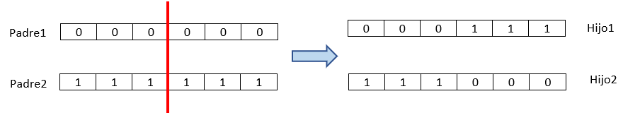
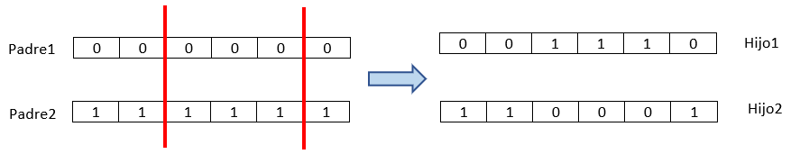
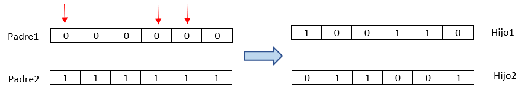
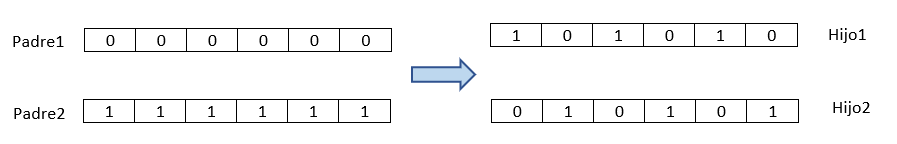
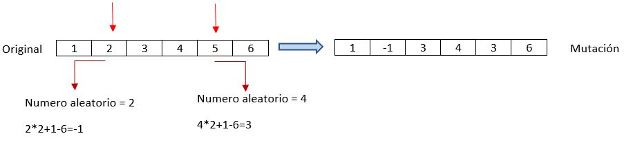
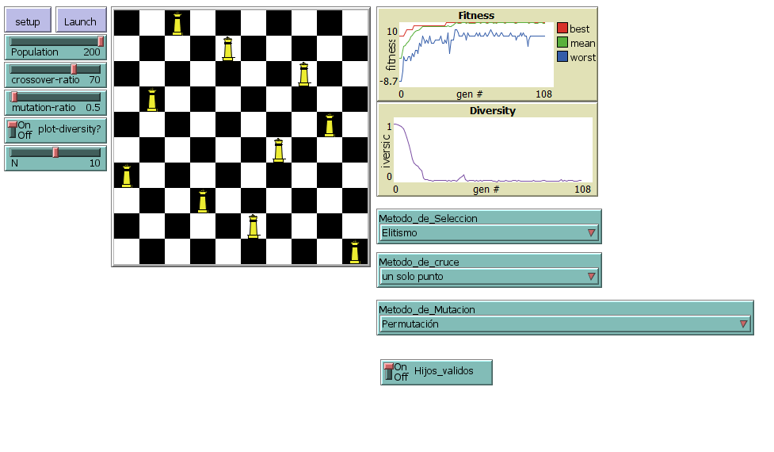
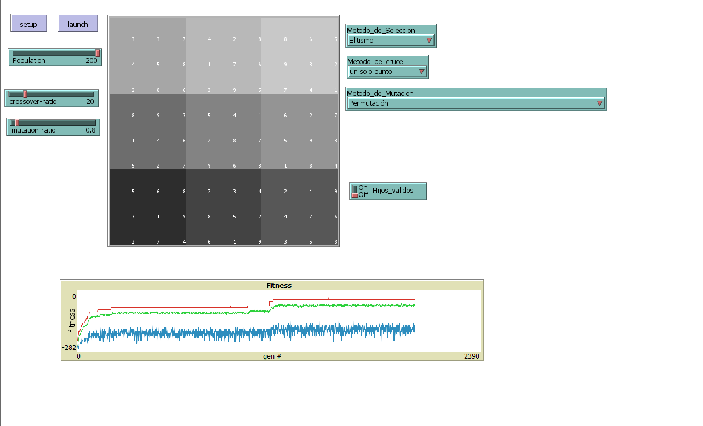

# **Práctica 2 IA - Algoritmos Genéticos**

## 1-Introducción

El objetivo de esta práctica es extender la librería que se  proporciona  respecto a los algoritmos genéticos. Se extenderán añadiendo métodos de selección, de cruzamiento y de mutación. He conseguido estandarizar los métodos de selección y de cruzamiento, pero los métodos de mutación no. A la hora de seleccionar los métodos de mutación hay que tener en cuenta el tipo de problema que tenemos.

Para probar los diferentes métodos, se han añadido a los problemas genéticos ya existentes poder seleccionar que métodos queremos y además se ha añadido dos problemas genéticos más complejos para apretar el algoritmo genético.

## 2-Métodos añadidos

### 2.1-Métodos de selección

Como podemos ver en el siguiente código, la llamada a crear la siguiente generación funciona como un *Switch* , dependiendo del método de selección, se lanzará el procedimiento correspondiente. Dentro de cada método de selección es donde se construye directamente la siguiente generación. Para los cruce y las mutaciones, dentro de los procedimientos de selección hay también un *Switch* para cada uno de ellos. Además como se verán en los códigos de los procedimientos, se ha añadido una opción para ciertos algoritmos de si se crean hijos no válidos estos no pasen a la siguiente generación, sino que pasen los padres(Switch hijos válidos).


```
to AI:Create-next-generation [#population #crossover-ratio #mutation-ratio]      
  ifelse(Metodo_de_Seleccion = "Torneo")[
    Torneo #population #crossover-ratio #mutation-ratio
  ][ifelse (Metodo_de_Seleccion = "Ruleta")[
    Ruleta #population #crossover-ratio #mutation-ratio
    ][ifelse (Metodo_de_Seleccion = "Rango")[
      Rango #population #crossover-ratio #mutation-ratio
      ][ifelse (Metodo_de_Seleccion = "Estado Estable")[
        EstadoEstable #population #crossover-ratio #mutation-ratio
      ][
        Elitismo #population #crossover-ratio #mutation-ratio
      ]
     ]
    ]
  ]  
end
```


Los diferentes métodos de selección seguirán el mismo esquema ( si hay alguna variación se aclarará):

Primero creamos una copia de la población en "old-generation". Decidiremos cuantos cromosomas serán cruzados en la variable "number-crossovers".Para los cruces elegimos los padres (aquí en donde entran los métodos de selección, cada uno elige a los padres de diferente forma). Una vez elegido los padres se realiza el cruce entre ellos (aquí es donde entra los métodos de cruce, llamando al procedimiento "AI:CrossoverSwitch", que redirecciona al procedimiento de cruce que deseamos). Una vez echo el cruce miramos si hemos activado "Hijos_validos", si este no esta activado se añaden los hijos directamente a la nueva generación y si se ha activado se mira si el hijo no es válido y si es así este no pasa a la siguiente generación. Una vez echo los cruce y añadidos los hijos a la siguiente generación. Seleccionamos de la misma forma cuales pasarán también a la siguiente generación sin cambios. Por último, se muta la nueva generación (aquí es donde entra los métodos de mutación, llamando al procedimiento "AI:mutateSwitch", que redirecciona al procedimiento de mutación que deseamos).


#### 2.1.1-Torneo

El método torneo consiste en coger "n" cromosomas de la población a la azar y de esos 3 seleccionar el mejor (Ese será un padre).

Parte del código que hace referencia a la forma de selección:

```
   ...
   let father1 max-one-of (n-of 3 old-generation) [fitness]
   let father2 max-one-of (n-of 3 old-generation) [fitness]
   ...
```

Este caso cogemos 3 cromosomas al azar de la "vieja generación" y de esos 3 elegimos el que tenga el mejor fitness, ese que seleccionamos será un padre.

#### 2.1.2-Rango

Este método hace que la probabilidad de que cada cromosoma sea elegido dependa del orden (rango) de cada uno y no de su valor del fitness. Esto lleva a que cada individuo tenga una parte casi igual del pastel y por lo tanto, cada individuo, sin importar qué tan adecuado sean entre sí, tiene aproximadamente la misma probabilidad de ser seleccionado como padre. Este tipo de selección viene bien cuando todos individuos son muy cercanos entre sí.

Para hallar la probabilidad de cada uno se ha utilizado la siguiente fórmula:

$$
P_i = (Amax - (Amax-Amin)·(rank-1)/(m-1))·1/m
$$

Siendo en nuestro caso **Amax** = 1.2 , **Amin** = 0.8 , **m**= Números de elementos de la lista(población) y **rank** = la posición en dicha lista. La lista ha de estar ordenada del mejor fitness al peor fitness.

Como podemos ver en el siguiente ejemplo de 3 cromosomas, la probabilidad de coger el cromosoma con fitness 10 es ligeramente mayor a la de fitness 5 , a pesar de tener el doble de fitness.

| Cromosoma | fitness | Rango | pi                                  |
| --------- | ------- | ----- | ----------------------------------- |
| (1 3 1)   | 5       | 2     | (1.2-0.4·(2-1)/(3-1))1/3 = **0.33** |
| (3 3 4)   | 10      | 1     | (1.2-0.4·(1-1)/(3-1))1/3 = **0.4**  |
| (0 0 1)   | 1       | 3     | (1.2-0.4·(3-1)/(3-1))1/3 = **0.27** |


El código al tener una cierta complejidad está comentado en netlogo, pero en resumen :

Pasamos todos los fitness a una lista y los ordenamos de mayor a menor, luego para aprovechar cada iteración al máximo , se lanzan dos números al azar antes de entrar en el bucle. En la misma iteración creamos la probabilidad del individuo "i" y vemos si se ha seleccionado para ser uno de los padres (con los números al azar). El bucle esta programado para nada mas que encuentre los dos padres salga de él. Así de esta forma no hay que hallar la probabilidad de todos los individuos ni recorrerlos todos.


#### 2.1.3-Ruleta

Este método es muy parecido al anterior, pero la probabilidad de cada individuo de ser elegido viene dado por lo bueno que sea este, es decir por su fitness. Este método hace referencia a tirar de una ruleta con el numero de individuos siendo el numero de opciones de la ruleta y el tamaño de cada una de estas es proporcional al fitness de cada individuo.

La formula utilizada para hallar la probabilidad de cada uno es :
$$
P_i=\frac{f_i}{\sum_{j=1}^{N}f_{i}}
$$
Donde **fi ** es el fitness de cada individuo i y **N** el tamaño de la población actual.

Con el mismo ejemplo del método anterior , ahora podemos ver que el cromosoma que tiene el doble de fitness también tiene el doble de probabilidad de ser elegido.

| Cromosoma | fitness | pi                |
| --------- | ------- | ----------------- |
| (1 3 1)   | 5       | 5/16 = **0.3125** |
| (3 3 4)   | 10      | 10/16 = **0.625** |
| (0 0 1)   | 1       | 1/16 = **0.0625** |


El código al tener una cierta complejidad está comentado en netlogo, pero en resumen :

Es muy parecido al método anterior, solo varía que tenemos que normalizar los fitness (por si hay fitness negativos) y el cálculo de la probabilidad. 

#### 2.1.4-Estado Estable

Este método de selección lo que busca es hacer que la mayoría de la población pase a la siguiente generación sin cambios. Para este método se seleccionará a los mejores individuos como los padres(unos pocos)  y los hijos de estos sustituirán a los peores individuos (unos pocos). De esta forma todos los individuos excepto algunos (los peores) pasan a la siguiente generación sin cambios. 

El código al tener una cierta complejidad está comentado en netlogo, pero en resumen :

Vamos eligiendo los padres que son los mejores de la población actual . Creamos dos hijos con el método de cruce que hayamos elegido y lo pasamos a la siguiente generación. A los dos peores los borramos de la población actual. Una vez echo todo lo anterior los que nos queden de la población actual (recuerda que los peores ya se han borrado de ahí) se copian todos a la siguiente generación (recuerda que hay ya están los hijos que sustituyen a los eliminados).

#### 2.1.5-Elitismo

Este método lo que busca es que unos pocos de los mejores individuos pasen a la siguiente generación sin cambios , todos los individuos que faltan de la <u>siguiente generación</u> serán todos cruces(incluido con los de élites, para ver si algún cruce entre ellos da uno mejor). Es decir los únicos individuos que pasan a la siguiente generación intactos son los elegidos como élites.


Parte del código que hace referencia a la forma de selección:

```
  ...
  let lista-fitnessaux (range 0)
  ask old-generation[set lista-fitnessaux lput fitness lista-fitnessaux]
  set lista-fitnessaux sort-by > lista-fitnessaux
  ...
  [    
    ask one-of old-generation with [fitness = item 0 lista-fitnessaux][hatch-AI:individuals 1]  
    set lista-fitnessaux but-first lista-fitnessaux  
  ]
  ...
```

Metemos todos los fitness de la población en una lista y los ordenamos del mejor al peor.  Luego le decimos a "old-generation" que un agente(individuo) que tenga ese fitness(el de la lista el elemento 0, es decir el mejor) pase a la siguiente generación(hatch). Borramos ese fitness seleccionado para así no elegirlo otra vez. Una vez elegidos todos los que pasan sin cambios se harán cruces entre todos hasta rellenar la siguiente generación.

### 2.2-Métodos de cruzamiento

En cada método de selección que es donde se crea la siguiente generación y donde se llama a los métodos de cruzamiento, se hace la llamada al procedimiento encargado de hacer el cruce entre los dos padres seleccionados. Para que haga el método de cruzamiento que nosotros deseamos llama a un "Switch" (AI:CrossoverSwitch) que es el encargado de direccionar el cruce que hemos indicado.

#### 2.2.1-Un Punto

En este método de cruce lo que se hace es seleccionar un punto del cromosoma, partir el cromosoma en ese punto(En los dos padres) e intercambiar los cromosomas por donde se ha partido. Ver ejemplo en la siguiente Imagen.




El código es:

```
to-report un_punto [c1 c2]
  let cut-point 1 + random (length c1 - 1)
  report list (sentence (sublist c1 0 cut-point)
    (sublist c2 cut-point length c2))
  (sentence (sublist c2 0 cut-point)
    (sublist c1 cut-point length c1))
end
```


#### 2.2.2-Dos Puntos

Parecido al anterior pero ahora hay dos puntos y se intercambia los genes entre esos dos puntos. Ver en la siguiente imagen:



El código es:

```
to-report dos_puntos [c1 c2]
  let cut-point1 1 + random (length c1 - 1)
  let cut-point2 cut-point1 + random (length c1 - cut-point1 - 1)
  report list (sentence (sublist c1 0 cut-point1)
    (sublist c2 cut-point1 cut-point2)
    (sublist c1 cut-point2 length c1))
  (sentence (sublist c2 0 cut-point1)
    (sublist c1 cut-point1 cut-point2)
    (sublist c2 cut-point2 length c1))
end
```

Nos aseguramos que el punto 2 esté por delante del punto 1 para no producir errores.

#### 2.2.3-Uniforme

El método de cruce uniforme consiste en intercambiar algunos genes entre los padres. La forma en la que lo he implementado es que cada gen "i" tiene una probabilidad de ser intercambiado del 50% entre los padres.

En la siguiente imagen podemos ver un ejemplo, los genes que se intercambian están marcados por una flecha:



El código es:

```
to-report uniforme [c1 c2]
  let i 0
  while [i < length c1][
    if random-float 1 < 0.5 and (item i c1 != item i c2)[
      let aux item i c1
      set c1 replace-item i c1 item i c2
      set c2 replace-item i c2 aux
    ]  
    set i i + 1
  ]
  report list (c1)(c2)
end
```

El código recorre todo el cromosoma y si los genes son distintos(no tiene sentido que los cambie si son iguales) con un probabilidad del 50% se intercambian el gen.

#### 2.2.4-Uniforme Media

Este se parece al método de uniforme pero la diferencia es que ahora no hay una probabilidad de que se intercambien los genes, sino que intercambian exactamente la mitad de los genes diferentes.

Un ejemplo en la siguiente imagen:



El código es:

```
to-report uniforme_media [c1 c2]
  let i 0
  let mitad random 2
  while [i < length c1 ][
    if item i c1 != item i c2[
      ifelse mitad = 0[
        let aux item i c1
        set c1 replace-item i c1 item i c2
        set c2 replace-item i c2 aux
        set mitad 1
      ][
        set mitad 0
      ]
    ]  
    set i i + 1
  ]
  report list (c1)(c2)
end
```

Lo primero que se hace en la variable mitad es guardar un "1" o "0" con aleatoriedad(Para que así haya una cierta aleatoriedad de cambiar la mitad y no sea siempre igual, esto hará que el primero se cambie o no). Para conseguir que sean la mitad de los genes distintos los que se intercambien , lo que hacemos es que cambiamos uno y el siguiente distinto no , eso lo conseguimos con la variable mitad que si es "0" se intercambian y si es "1" no se intercambian.

### 2.3-Métodos de Mutación

Como pasa con los métodos de cruzamiento, la llamada a una mutación se hace al final de los métodos de selección cuando la nueva generación ha sido ya construida. Se hace una llamada al procedimiento "AI:mutateSwitch" que redirecciona al método de mutación que deseamos. Hay que tener cuidado en la elección de los métodos de mutación , ya que estos están echo cada uno para unos valores del gen concretos. Depende del problemas hemos de elegir el método de mutación que le corresponda con los valores del cromosoma.

#### 2.3.1-Flit-bit (Valores binarios)

Este método de mutación lo que hace es cambiar con la probabilidad que indicamos en "#mutation-ratio" la negación de un bit. Por lo que este método está echo para valores binarios.

El código es:

```
to Flit-bit [#mutation-ratio]
  set content map [ b -> ifelse-value (random-float 100.0 < #mutation-ratio) [1 - b] [b] ] content
end
```

Recorremos todo el contenido del cromosoma y con la probabilidad indicada por "#mutation-ratio" bien lo negamos o bien lo dejamos intacto.

#### 2.3.2-Permutación

Este método de mutación consistes en intercambiar dos genes del mismo individuo. La ventaja de este método es que es válido para cualquier tipo de problema , ya que no escribe valores solo los cambia de posición. 

El código es:

```
to permutacion [#mutation-ratio]
  let i 0
  while [i < length content][
    if random-float 100.0 < #mutation-ratio [
      let pos random length content
      let valori item i content
      set content replace-item i content item pos content
      set content replace-item pos content valori
    ]    
    set i i + 1
  ]   
end
```

Recorremos todo el cromosoma y si se cumple la probabilidad intercambiamos los datos con una posición al azar.

#### 2.3.3-Perímetro con valores negativos

Este método solo se puede usar en aquellos problemas que los valores del cromosomas sean reales o flotantes. Este método cambia el valor de un gen a un valor aleatorio dentro de un perímetro establecido. Por defecto se ha implementado que el perímetro sea  el valor del gen mas grande del cromosoma.

El código es:

```
to PerimetroNeg [#mutation-ratio]
  let peri max content
  set content map [ b -> ifelse-value (random-float 100.0 < #mutation-ratio)
  [((random peri * 2) + 1) - peri] [b]] content
end
```

La variable "peri" es el valor mas grande del cromosoma. Luego para decir el número por el que se va a mutar se halla un numero aleatorio entre el cero y el doble de "peri" y luego se resta ese número por "peri". Así por ejemplo de ser el número mas grande el 5, el valor mínimo que se puede tener es `0 + 1 - 5 = -4` y valor máximo `8 + 1 - 5 = 4`

En la siguiente imagen se puede ver un ejemplo:




#### 2.3.4-Perímetro con valores positivos

Es muy parecido al método anterior pero este es para problemas con números enteros o flotantes positivos.

El código es:

```
to PerimetroPos [#mutation-ratio]
  let peri max content
  set content map [ b -> ifelse-value (random-float 100.0 < #mutation-ratio) [random peri] [b] ] content
end
```

#### 2.3.5-Mutación con vecinos

Al principio es igual que el anterior método , un gen puede mutar a un número dentro de un perímetro pero además los vecinos de ese gen tienen el doble de probabilidad de también cambiar. Este método puede servir para aquellos problemas donde los genes con los vecinos tengan una cierta conexión.

El código es:

```
to Mutvecinales [#mutation-ratio]
  let peri max content
  let i 1
  while [i < length content - 1][
    if random-float 100.0 < #mutation-ratio [
      let nuevovalor random peri + 1
      let valori item i content
      set content replace-item i content nuevovalor
      let dife nuevovalor - valori
      let j -1
      repeat 2 [
        if random-float 100. < #mutation-ratio + #mutation-ratio[
          set nuevovalor (item (i + j) content) + dife
          set content replace-item (i + j) content (abs nuevovalor)
        ]
        set j 1
      ]
    ]    
    set i i + 1
  ]  
end
```

Se reemplaza un gen como en el método de perímetro pero ahora además se calcula una diferencia y esa se le aplica a los vecinos con el doble de probabilidad.

## 3-Probando los métodos

En todos los problemas de algoritmos genéticos que se ya se proporcionan se ha añadido la opción de poder cambiar los métodos tanto de selección, cruzamiento y de mutación para poder probarlos. Además se han añadido dos problemas más para probar mas afondo dichos métodos.

Antes de comentar los nuevos problemas voy a exponer algunas curiosidades probando los nuevos métodos con los problemas ya existentes.

1. En el problemas de las reinas si tenemos la configuración como en la siguiente imagen con la activación de "Hijos_validos" se resuelve el problema que había antes de que le costaba encontrar la solución. Ahora lo resuelve a una velocidad mas considerable y proporcionando una solución válida gracias al modo "Hijos válidos".




2. El problema de la aproximación de un algoritmo polinomial , se ve bastante acelerado a la hora de hallar la aproximación atreves del método de selección Elitismo, además con un aproximación mas exacta que con los demás métodos.


3. En el problema de la función no se ha podido usar los métodos de mutación ya que dicho problema al tener un procedimiento muy específico para crear las mutaciones , no funciona con métodos de mutaciones estándar.

#### 3.1-Problema variación de la mochila

He querido crear un problema donde pueda apretar un poco más al algoritmo genético añadiendo unas cuantas restricciones más.

Este problema es parecido a la de la mochila pero con algunas modificaciones personales. Ahora cada objeto aparte de tener el valor y el peso, tiene dos atributos más. Cada objeto puede cogerse varias veces con un tope indicado por "Macobjs" y además habrá algunos objetos que será obligatorio que estén en la mochila si o si representado por un valor binario. El fitness ahora se calcula sumando el valor de la mochila y penalizando por cada condición que no cumpla, que son 3: pasarse del peso, poner alguno objeto mas veces de lo permitido y no poner un objeto que ha de estar en la mochila.

Aún añadiendo ese par de restricciones el algoritmo ha demostrado ser muy eficaz y resolver sin ningún tipo de problema, no pasa lo mismo en el siguiente problema(Spoiler).


#### 3.2-Problema Sudoku

Para poner aún más a prueba el algoritmo genético lo he implementado para resolver un sudoku.

Lo primero que se hace es construir el tablero e inicializar cada cromosoma con algunos valores que hacen que el sudoku tenga solución el resto de los huecos se rellenan con números aleatorios.

```
to AI:Initial-Population [#population]
  create-AI:individuals #population [
    let l [0 0 6 4 2 8 0 0 0 4 5 0 1 7 6 0 3 2 0 8 7 3 9 5 0 4 1 0 9 3 5 8 0 7 0 0 0 4 0 2 0 7 0 9 3 7 2 0 9 0 0 5 6 0 5 6 8 0 3 4 2 0 9 0 1 0 8 0 0 3 7 6 0 7 0 6 1 0 4 8 0]
    set l map[b -> ifelse-value b = 0[(random 8)+ 1][b]] l
    set content l
    AI:Compute-fitness
    hide-turtle
  ]
end
```

El cromosoma representa el Sudoku, cada gen el número que tiene en cada casilla. Para calcular el fitness los que se hace es mirar las filas, las columnas y los cuadrantes. Si se repite algún numero o se pasan del valor 9 se sumará una incongruencia, luego el número de incongruencias se multiplicará por -10 y ese será el fitness. En el caso del que el sudoku se resuelva su fitness será "0". Por lo que el fitness o me dice que está resuelto o me dice el número de incongruencias que hay.

He probado resolver este problema con todas la combinaciones posibles entre los diferentes métodos y ninguna me ha conseguido llevar a la solución final. Aunque se ha llegado a acercar bastante, como vemos en el siguiente ejemplo:




Esto me lleva a pensar que o siguiendo estos ciertos métodos estándar hay darle mucho más tiempo para que llegue a una solución o mas bien necesita unos métodos muy específico para poder resolverlo gratamente. Al contrario del método anterior que funciona muy bien con estos métodos estandarizados.


Trabajo realizado por Abel Blanco Lucas


