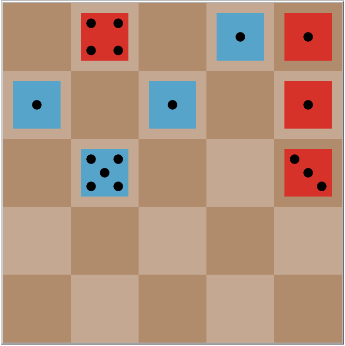

# **Práctica 1 IA - Cephalopod**

## Objetivo de la práctica

Nuestro objetivo es crear un jugador automático para el juego Cephalopod para ello vamos a usar el algoritmo MCTS.

## Conceptos del juego

* **<u>Descripción</u>** 

  Se enfrentan dos jugadores sobre un tablero de 5x5 casillas. Cada uno de los jugadores utiliza dados de determinado color (Azul y Rojo), que van colocando en casillas libres del tablero.

* **<u>Objetivo del juego</u>**

  La finalidad del juego es conseguir que al final del juego, cuando el tablero está lleno, el número de dados propios sea mayor que el número de dados del rival.

* <u>**Desarrollo del juego**</u>

  Los movimientos se harán por turnos alternativos de cada jugador. Consisten en incorporar un dado en una casilla libre del tablero.

  En ocasiones al colocar el dado es posible realizar capturas, dependiendo de los dados que puedan estar situados en las casillas adyacentes:

  * Si hay menos de dos dados situados en casillas adyacentes (vertical u horizontalmente, no en diagonal), no se produce captura, y el dado introducido debe mostrar el valor 1.
  * Si hay dos dados adyacentes y la suma de sus valores es inferior a 7, ambos dados son apartados del tablero y el nuevo dado muestra el valor de la suma de los dados capturados.
  * Si hay tres o cuatro adyacentes, el jugador elige entre ellos los dados que desee capturar, siempre que sean al menos dos y su suma sea inferior a 7.
  * No hay posibilidad de capturar cuando, a pesar de haber dos o más dados adyacentes, la suma de los dos valores inferiores es superior a 6. En este caso no se produce captura y el dado introducido queda con el valor 1.


​	Los dados capturados pueden ser propios o del oponente, y dichos dados capturados son eliminados del tablero.

​	No está permito pasar.

​	El juego finaliza cuando no quedan casillas libres en el tablero. Dado que el número de casillas es impar, no es posible que se 	produzcan empates.

## Representación del problema

* **Estado del problema**

  Para nosotros el estado del problema será una lista formada por cada casilla del tablero y el jugador que ha llegado a ese estado. Cada uno de las casillas tendrá dos elementos, el primero hará referencia ha si tiene un dado o no y de que jugador es el dado. El segundo elemento que es una lista aunque siempre formada por un solo elemento hará referencia en caso de tener un dado la casilla al valor del dicho dado, en caso de no tener un dado será una lista vacía.

* **Tablero**




Así es como sería la representación del tablero en este caso:

```
[
[0 []] [2 [4]] [0 []] [1 [1]] [2 [1]]
[1 [1]] [0 []] [1 [1]] [0 []] [2 [1]]
[0 []] [1 [5]] [0 []] [0 []] [2 [3]] 
[0 []] [0 []] [0 []] [0 []] [0 []]
[0 []] [0 []] [0 []] [0 []] [0 []]
]
```

De esta forma es como la IA puede entender el tablero y saber donde hay colocados dados y que valor tienen.

* **Jugador**

  El 1 hace referencia al jugador humano mientras el 2 hace referencia a la IA
  
* **Reglas del juego**

  La regla del juego es que solo se puede colocar un dado en una casilla donde ya no haya un dado. Mirando el estado se sabe donde no hay dados por que el primer elemento de cada casilla es un 0.

* **Aplicación de las reglas**

  Al colocar un dado se debe comprobar los vecinos y sumar tal como se explica en al apartado *Conceptos del juego* teniendo así que cambiarse el estado. Tal como vamos a ver en el siguiente ejemplo.

  

  

  

En el primer tablero tendrá el estado:
```
[
[0 []] [0 []] [2 [3]] [0 []] [1 [1]]
[0 []] [2 [1]] [0 []] [0 []] [0 []]
[0 []] [0 []] [0 []] [0 []] [0 []] 
[0 []] [0 []] [0 []] [0 []] [0 []]
[0 []] [0 []] [0 []] [0 []] [0 []]
]
```

al colocar un dado en donde esta señalizado por una 'X' el estado del tablero pasará ha :
```
[
[0 []] [0 []] [0 []] [1 [4]] [0 []]
[0 []] [2 [1]] [0 []] [0 []] [0 []]
[0 []] [0 []] [0 []] [0 []] [0 []] 
[0 []] [0 []] [0 []] [0 []] [0 []]
[0 []] [0 []] [0 []] [0 []] [0 []]
]
```

## Interfaz gráfica


1. Tablero donde se colocan lo dados
2. Botón *setup* el cuál resetea el juego para empezar una partida de nuevo.
3. Botón *go* el cuál sirve para que el juego corra.
4. Consola de salida el cual mostrará de quién es el turno actual y en caso de que haya elegir dados para sumar lo indicará con un mensaje.
5. Switch para  elegir jugar contra la IA o jugar humano vs humano
6. Las iteraciones máximas con las que queremos que trabaje la IA
7. Botón que en el caso de tener que elegir los dados que queremos sumar, una vez elegidos los dados pulsamos este botón para sumar los dados

##  Funcionamiento de la IA

En varias pruebas empíricas la IA ha demostrado ser bastante eficiente, ya que he probado a familiares como conejillos de indias y la IA ha conseguido ganar el 80% de las partidas jugadas ( todas con el Max_iterations a 5500).

En este juego ha varias estrategia para asegurarte que haya dados que se queden en tablero si o si para el jugador que las coloque. La IA ha demostrado que es capaz de llegar a dichas soluciones para asegurarse tener dados para el recuento final. Las explicaré a continuación:

1. Una estrategia es conseguir sumar un dado 6 para ti , ya que si acabas con un dado tuyo con valor 6 te aseguras que ese dado no puede ser eliminado. La IA ha demostrado que va ha intentar conseguir un dado con valor 6 para ella, cuando te quieres dar cuenta la IA no hace mas que conseguir dados con valor 6 mientras tu no.
2. Otra estrategia que consigue llevar a cabo la IA es colocar un dado rodeados por dados con valor 6, ya que aunque coloques un dado con valor 1 al ser todos sus vecinos 6 ese dado no va a ser eliminado nunca y así te seguras otro dado. Lo explico con un ejemplo:


Como podemos ver en el tablero de arriba el dado rodeado por un círculo ya no podrá ser eliminado el resto de la partida y en este caso el jugador azul se habrá asegurado dicho dado para el recuento final. Esto la IA lo tiene en cuenta y cuando haya una oportunidad así colocará el dado en dicho lugar para asegurarlo. Incluso a veces te incita a que tu te lleves el dado con valor 6 para ella luego colocar el dado y ambos habréis conseguido bloquear un dado. 

- **Problemas de la IA**

  Por temas de programación cuando la IA se encuentra en la situación de tener 3 o 4 vecinos y tener que elegir que vecinos y sumar y cuales no, se ha programado de tal manera que siempre buscará sumar el valor más alto (Para así asegurar que sume un 6) al haberlo puesto así, en si no es un problema por que si al hacer la suma luego tu puedes sumar un 6 no la hará. Pero en el algoritmo Montecarlo la IA no contempla que el jugador humano pueda hacer una suma menor a la máxima posible. Este es en el único sentido que la IA esta un poco capada, pero a la hora de jugar ha demostrado no ser impedimento para que sea un rival digno.

## Alguna explicaciones del código y funcionamiento de elegir dados

El código esta estructurados en 4 bloques lo verás porque cada bloque esta separado en netlogo por "=================="

1. <u>Bloque 1:</u> Es la parte del código que hace referencia al juego de humano vs humano esta parte es la que se ejecutará al poner el switch en modo OFF.
2. <u>Bloque 2:</u> Es la parte del código que hace referencia al juego de humano vs IA esta parte es la que se ejecutará al poner el switch en modo ON. Además aquí es donde está todo lo referente al MCTS.
3. <u>Bloque 3:</u> Es un pequeño bloque donde está el código que se ejecuta cuando debemos elegir dado para sumar. 
4. <u>Bloque 4:</u> Un bloque con todas las funciones auxiliares que se utilizan a lo largo del código


Explicaré a continuación como es para el usuario el proceso de elegir dados y como sumarlo.


En este ejemplo se acaba de colocar el dado que está rodeado por un círculo que como podemos comprobar tiene 4 dados vecinos ( y existe la posibilidad de que la suma de los dados sea menor igual que 6) Al colocar dicho dado pasamos al estado "elegir dados" que se nos indicará visualmente por la ventada de salida que esta marcada por la flecha roja. Una vez hayamos colocado el dado demos elegir que dados deseamos sumar ( simplemente pinchando en ellos, también se puede deseleccionar), en este caso los dados seleccionados son aquellos con un tono más oscuro, para que así el usuario sepa cuáles tiene seleccionados. Una vez seleccionados los dados que se desean sumar pulsamos el botón "sumar-elegidos" que se encuentra abajo a la derecha y si la suma de los dados en menor igual que 7 ( en este caso la suma será 2 ) se realizará dicha suma y el dado que se acababa de colocar ( el que esta rodeado por el círculo )  pasará a tener el valor de la suma. Los dados que se habían seleccionado en la suma serán eliminados.


Trabajo realizado por Abel Blanco Lucas


